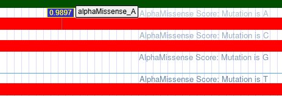

# Clinical Variant Annotation of Rare Genetic Disorders

<p align="center">
  
  
  
  
</p>

---

## Overview

This repository documents a structured clinical variant interpretation workflow applied to three rare genetic disorders. For each condition, one clinically significant variant was selected from **ClinVar**, annotated with phenotype data from **OMIM**, evaluated using **AlphaMissense** and **REVEL** pathogenicity predictors via the **UCSC Genome Browser**, and classified according to **ACMG/AMP evidence-based guidelines**.

---

## Disorders and Variants Studied

| # | Disorder | Gene | Variant (HGVS Protein) | Chromosomal Position (GRCh38) |
|---|---|---|---|---|
| 1 | Cystic Fibrosis | *CFTR* | p.Gly551Asp (G551D) | chr7:117,587,806 |
| 2 | Familial Hypercholesterolemia | *LDLR* | p.Asp227Glu (D227E) | chr19:11,105,587 |
| 3 | Phenylketonuria | *PAH* | p.Arg408Trp (R408W) | chr12:102,852,747 |

---

## Pathogenicity Summary

| Disorder | Gene | Variant | AlphaMissense Score | REVEL Score | ClinVar Review Status | ACMG Classification |
|---|---|---|---|---|---|---|
| Cystic Fibrosis | *CFTR* | p.Gly551Asp | 0.9897 — Likely Pathogenic | 0.99 — Pathogenic | Expert Panel Reviewed ★★★★ | Pathogenic |
| Familial Hypercholesterolemia | *LDLR* | p.Asp227Glu | 0.9881 — Likely Pathogenic | 0.864 — Pathogenic | Multiple Submitters ★★★ | Pathogenic |
| Phenylketonuria | *PAH* | p.Arg408Trp | 0.999 — Pathogenic | 0.79 — Pathogenic | Expert Panel Reviewed ★★★★ | Pathogenic |

---

## Variant Annotation

### 1. Cystic Fibrosis — *CFTR*: NM_000492.4:c.1652G>A (p.Gly551Asp)

**Variant Information**

| Field | Detail |
|---|---|
| Variant Type | Single Nucleotide Variant (SNV) |
| ClinVar ID | [VCV000007107](https://www.ncbi.nlm.nih.gov/clinvar/variation/7107/) |
| dbSNP | rs75527207 |
| OMIM | [#219700](https://www.omim.org/entry/219700) |
| Inheritance | Autosomal Recessive |

**Molecular Mechanism**

This Class III "gating" mutation substitutes Glycine for Aspartic Acid at codon 551 of the CFTR protein. The structural change prevents the chloride channel from opening in response to ATP binding, resulting in near-total loss of ion transport activity (<1% of normal). This leads to the accumulation of thick, viscous mucus characteristic of Cystic Fibrosis.

**Clinical Features**

Chronic obstructive pulmonary disease with recurrent infections, exocrine pancreatic insufficiency, elevated sweat chloride concentrations (>60 mmol/L), and in affected males, congenital bilateral absence of the vas deferens (CBAVD).

**Pharmacogenomic Relevance**

Carriers of this variant demonstrate significant clinical response to **Ivacaftor**, a CFTR channel potentiator, as confirmed in the STRIVE and ENVISION phase III clinical trials.

**ACMG/AMP Evidence**
- **PS3** — Functional studies confirm near-complete loss of chloride channel gating activity
- **PS4** — Variant prevalence significantly elevated in affected individuals vs. controls
- **PP3** — Convergent computational evidence of pathogenicity (AlphaMissense: 0.9897, REVEL: 0.99)

---

### 2. Familial Hypercholesterolemia — *LDLR*: NM_000527.5:c.681C>G (p.Asp227Glu)

**Variant Information**

| Field | Detail |
|---|---|
| Variant Type | Single Nucleotide Variant (SNV) |
| ClinVar ID | [VCV000000251](https://www.ncbi.nlm.nih.gov/clinvar/variation/251/) |
| dbSNP | rs121908028 |
| OMIM | [#143890](https://www.omim.org/entry/143890) |
| Inheritance | Autosomal Dominant |

**Molecular Mechanism**

This missense mutation disrupts a critical calcium-binding site within the fifth repeat of the LDLR ligand-binding domain. Despite both Aspartic Acid and Glutamic Acid being negatively charged residues, the substitution alters the local conformation sufficient to impair receptor folding and LDL particle binding. The result is a "binding-defective" receptor with markedly reduced capacity to clear circulating LDL cholesterol. This variant is recognized as the "FH Afrikaner-1" founder mutation.

**Clinical Features**

Significantly elevated plasma LDL cholesterol, early-onset atherosclerosis, premature coronary artery disease, tendon xanthomas, xanthelasma, and corneal arcus.

**ACMG/AMP Evidence**
- **PS4 (Very Strong)** — Identified in 33 clinically confirmed FH index cases
- **PP1 (Strong)** — Segregation confirmed across 22 informative meioses in multiple families
- **PS3 (Moderate)** — Functional assays demonstrate 5–15% LDLR activity in patient fibroblasts
- **PM1** — Located in a critical functional domain (Exon 4, ligand-binding repeat 5)
- **PM2** — Rare in population databases (gnomAD MAF = 0.003%)
- **PP3** — Strong computational support (REVEL: 0.864, AlphaMissense: 0.9881)
- **PP4** — Patient phenotypes highly specific for LDL receptor deficiency

---

### 3. Phenylketonuria — *PAH*: NM_000277.3:c.1222C>T (p.Arg408Trp)

**Variant Information**

| Field | Detail |
|---|---|
| Variant Type | Single Nucleotide Variant (SNV) at CpG hotspot |
| ClinVar ID | [VCV000000577](https://www.ncbi.nlm.nih.gov/clinvar/variation/577/) |
| dbSNP | rs5030858 |
| OMIM | [#261600](https://www.omim.org/entry/261600) |
| Inheritance | Autosomal Recessive |

**Molecular Mechanism**

A C>T transition at a CpG dinucleotide hotspot replaces Arginine with Tryptophan at codon 408 within the catalytic domain of the phenylalanine hydroxylase (PAH) enzyme. The bulky indole side chain of Tryptophan is structurally incompatible with the native conformation, causing severe protein misfolding, accelerated degradation, and near-total loss of enzymatic activity (<2% residual). This results in toxic accumulation of phenylalanine in the bloodstream and central nervous system.

**Clinical Features**

Severe intellectual disability, microcephaly, seizures, global developmental delay, hypopigmentation of skin and hair (secondary to impaired melanin synthesis), and a characteristic musty or "mousy" body odor from phenylacetate accumulation.

**ACMG/AMP Evidence**
- **PS3 (Strong)** — Enzyme activity reduced to <2% in functional studies
- **PM3 (Strong)** — Observed in trans with other pathogenic PAH variants in multiple affected individuals
- **PP3 (Supporting)** — AlphaMissense score of 0.999; among the highest pathogenicity predictions recorded
- **PP4 (Moderate)** — Clinical phenotype highly specific for phenylalanine hydroxylase deficiency

---

## Repository Structure

```
Clinical_Variant_Annotation/
│
├── Data/
│   ├── patient_variants.vcf                    # Raw curated VCF (ClinVar-sourced variants)
│   ├── patient_final_filtered.vcf              # BCFTools-filtered and fully annotated VCF
│   └── Clinical_Variant_Annotation_Report.xlsx # Complete clinical annotation report
│
├── UCSC_Visualizations/
│   ├── CF_Alpha.png / CF_revel.png
│   ├── FH_Alpha.png / FH_revel.png
│   └── PKU_Alpha.png / PKU_revel.png
│
├── pipeline.sh   # BCFTools variant filtering and extraction pipeline
└── README.md     # Project documentation
```

---

## Reproducing the Analysis

**1. Clone the repository**
```bash
git clone https://github.com/YOUR_USERNAME/Clinical_Variant_Annotation.git
cd Clinical_Variant_Annotation
```

**2. Review the annotation report**

Open `Data/Clinical_Variant_Annotation_Report.xlsx` in Microsoft Excel or LibreOffice Calc to access the complete variant annotations, OMIM phenotype descriptions, AlphaMissense/REVEL scores, and ACMG classifications.

**3. Inspect the VCF files**
```bash
# Raw curated variants
cat Data/patient_variants.vcf

# Filtered and annotated output
cat Data/patient_final_filtered.vcf
```

**4. Run the filtering pipeline**
```bash
# Requires BCFTools (https://samtools.github.io/bcftools/)
bash pipeline.sh
```

**5. ClinVar Submission**

The VCF file can be submitted to the [ClinVar Submission Portal](https://www.ncbi.nlm.nih.gov/clinvar/docs/submission_portal/) for automated annotation and validation.

---

## Tools and Databases

| Resource | Version / Release | Purpose |
|---|---|---|
| [ClinVar](https://www.ncbi.nlm.nih.gov/clinvar/) | 2026 | Variant selection and clinical significance curation |
| [OMIM](https://www.omim.org/) | Current | Gene–phenotype relationships and inheritance patterns |
| [UCSC Genome Browser](https://genome.ucsc.edu/) | hg38 | AlphaMissense and REVEL track visualization |
| [AlphaMissense](https://alphamissense.hegelab.org/) | v1.0 | Deep-learning structural pathogenicity prediction |
| [REVEL](https://sites.google.com/site/revelgenomics/) | Latest | Ensemble missense variant pathogenicity scoring |
| [BCFTools](https://samtools.github.io/bcftools/) | v1.18 | VCF filtering, extraction, and manipulation |

---

## Pathogenicity Score Visualizations (UCSC Genome Browser)

### Cystic Fibrosis — *CFTR* (chr7:117,587,806)

| AlphaMissense | REVEL |
|---|---|
|  |  |

### Familial Hypercholesterolemia — *LDLR* (chr19:11,105,587)

| AlphaMissense | REVEL |
|---|---|
|  |  |

### Phenylketonuria — *PAH* (chr12:102,852,747)

| AlphaMissense | REVEL |
|---|---|
|  |  |

---

## References

1. CFTR2 Expert Panel (2017). ClinVar expert panel review of CFTR:c.1652G>A.
2. Gregory, R.J. et al. (1991). Maturation and function of cystic fibrosis transmembrane conductance regulator variants bearing mutations in putative nucleotide-binding domains 1 and 2. *Molecular and Cellular Biology*, 11(8), 3886–3893.
3. Hobbs, H.H. et al. (1992). Molecular genetics of the LDL receptor gene in familial hypercholesterolemia. *Human Mutation*, 1(6), 445–466.
4. Blau, N. et al. (2010). Phenylketonuria. *The Lancet*, 376(9750), 1417–1427.
5. Richards, S. et al. (2015). Standards and guidelines for the interpretation of sequence variants. *Genetics in Medicine*, 17(5), 405–424.
6. Cheng, J. et al. (2023). Accurate proteome-wide missense variant effect prediction with AlphaMissense. *Science*, 381(6664).
